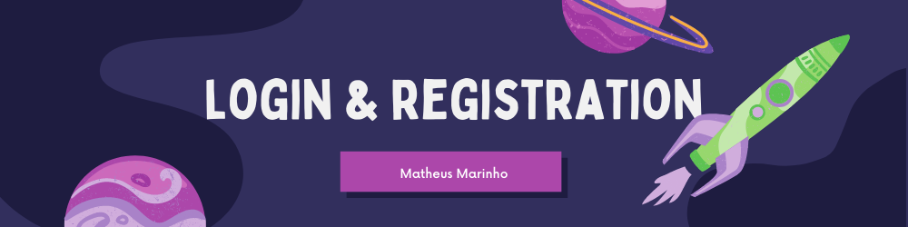

<h1 align="center">
  
</h1>

<h4 align="center"> 
	 Projeto Concluído 🚀   
</h4>

<h2 align="center" > Navegação </h2>

 <a href="#objetivo">Objetivo</a> •
 <a href="#sobre">Sobre</a> • 
 <a href="#tecnologias">Tecnologias</a> • 
 <a href="#licenc-a">Licença</a> • 
 <a href="#autor">Autor</a>

<h2 align="left" id="objetivo">  Objetivo </h2>

<h4> O principal objetivo deste projeto é treinar minhas habilidades de animação e principalmente mostrar minhas habilidades. </h4>

<h2 align="left" id="sobre">  Sobre </h2>

<h4>  O projeto consiste em um formulario de login e registro totalmente responsivo e animado.  </h4>

<h2 align="left" id="tecnologias"> 🛠 Tecnologias </h2>

As seguintes ferramentas foram usadas na construção do projeto:

<h1 aling="center">
  
</h1>

<h2 align="left" id="licen-a">  Licença MIT </h2>

<h2 align="left" id="autor">  Autor </h2>

<a href="#">
 
  
 <b>Matheus Marinho</b></a> <a href="#" title="Matheus Marinho">🚀</a>

Feito com ❤️ por Matheus Marinho 👋🏽 Entre em contato!

 

